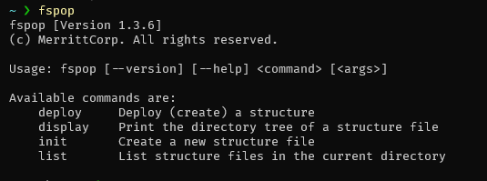

# fspop

Automate the creation of file structures using custom templates.

fspop => **f**(ile) **s**(tructure) **pop**(ulate)



## Usage

### Create a new structure file

The fastest way to create a new structure is to use the `init` command.

```bash
$ fspop init [STRUCTURE_NAME]
```

### Deploy a structure

Deploying a structure is as simple as calling `deploy` and giving the file name of the structure file.

```bash
$ fspop deploy [STRUCTURE_NAME]
```

## Defining a Structure File

(Use `fspop init` to create a new structure file instantly)

Structure files are written in YAML `.yaml` and require two things.

1. entrypoint
2. structure

Items are assumed to be a files, folders are defined by having a slash `/` at the end.

```yaml
- file.mp3
- folder/:
      - another_folder/
```

`fspop` will run though the entire structure and create a file or directory for each item

```yaml
name: media
entrypoint: path/to/media

structure:
    - games/
    - music/:
          - file.mp3
    - photos/:
          - personal/
          - family/
```

### Data variables

Files can be created with content added into them. This is done using `data` variables.

The name of a data variable can be anything you like, `example`, `readme`, and `image` are made up variable names that could be anything.

The value of a data variable can also be anything you like. `fspop` can load text, local files and even download URL content.

-   text
-   local file
-   URL

Data variables are defined once, in the `data:` section, and then can be used for **multiple** files in the `structure:` section.

```yaml
name: data example
entrypoint: fspop/data

data:
    - example: text can be added to a file like this
    - readme: ../path/to/local/file/README.md
    - image: https://via.placeholder.com/400/771796
    - earnings_report: https://example.com/earnings/report.pdf

structure:
    - example.file: example
    - readme.md: readme
    - image.png: image
    - earnings.pdf: earnings_report
    - earnings-backup.pdf: earnings_report # data variables can be re-used
```

### Dynamic variables

`fspop` can create many files/folders at once with one variable.

Options:

-   `amount` : amount of files/folders to create (any number above 0)
-   `data` : data variable to use to add content into files (all files created will have the data content)
-   `type` : `file` or `folder` - type of item to create
-   `name` : name of each item, `$num` is used to number each item (if name is `report ($num).pdf`, then the 50th file will be `report (50).pdf`)
-   `padded` : `true` or `false` - pad name with `0`s so all items have the same length, `report (50)` -> `report (050)`
-   `start` : starting number for name `$num`

The `amount` option is **required** (the rest have default values).

Dynamic items are used by their name + a `$`:

-   `$dynamicItem`

```yaml
name: data example
entrypoint: fspop/data

data:
    - earnings_report: https://example.com/earnings/report.pdf

dynamic:
    - dynamicItem:
          - amount: 1001
          - data: earnings_report
          - type: file
          - name: earnings_$num.pdf
          - padded: true
          - start: 50

    - manyFolders:
          - amount: 5000
          - type: folder
          - name: folder ($num)
          - padded: true

structure:
    - $dynamicItem
    - folder/:
          - $dynamicItem # dynamic variables can be re-used
```

## Commands

| Command   | Description                                       |
| --------- | ------------------------------------------------- |
| `deploy`  | Creates file structure from config file           |
| `display` | Print the directory tree of a structure file      |
| `init`    | Creates a new structure config file               |
| `list`    | List all structure files in the current directory |

<br>

## License

NONE: CLOSED SOURCE
